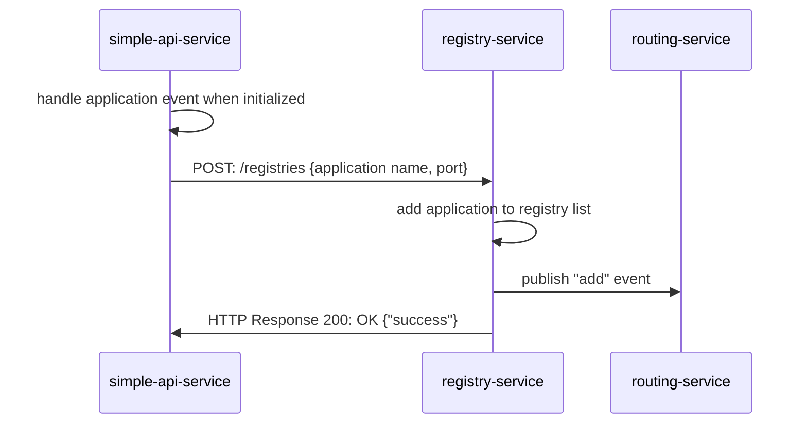
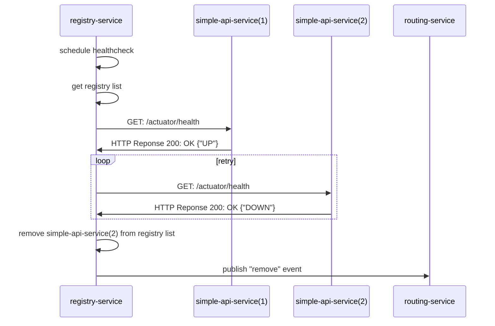

# registry-service
Registry Service for handling service (a.k.a. instance) registration, maintaining the registry list, and handling health check for each instance. Consisting of 2 modules: registry and healthcheck.   

### Registry Module
Handle HTTP request for Registry API and publish event to **routing-service** when registry list is modified

### Healthcheck Module
Handle logic to maintain the registry list by performing healthcheck to each instance in the list

 

## System Flow
### Register service to registry

### Maintain and healthcheck registry list

For more information on other flows and services, see also [simple-api-service](https://github.com/punyisakra/simple-api-service) and [routing-service](https://github.com/punyisakra/routing-service)
